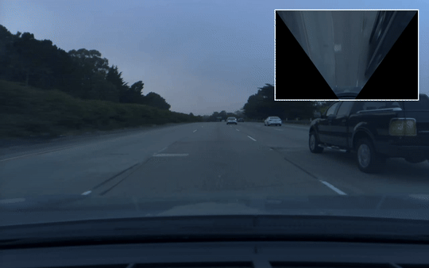

# IPM (Inverse Perspective Mapping) Project

## Features Log
### V2 - 6/24/2025
- **Logging and Performance**: Logging real-time performance tracking
- **Error Handling**: exception handling
### V1 - 06/24/2025
- **IPM Transformation**: Implemented inverse perspective mapping to convert road view to bird's-eye view
- **Picture-in-Picture Display**: Added overlay functionality showing both original and transformed views
- **Video Processing**: Real-time video processing with OpenCV
- **Configurable Parameters**: Hard-coded transformation parameters (param1=570, param2=35)
- **Output Generation**: Saves processed video as MP4 format
- **Interactive Display**: Live preview with 'q' key exit option
### Waymo Open Dataset - Perception v1.4.3
1: FRONT, 2: FRONT_LEFT, 3: FRONT_RIGHT, 4: SIDE_LEFT, 5: SIDE_RIGHT
- Images: [1, 2, 4, 3, 5]
- LIDARs: [1, 2, 3, 4, 5]
- IMU: Present
- GPS Pose: Present
- Timestamp: 1579641135577093 - 2020-01-21T00:32:15.577093+00:00

## notes
1. https://www.youtube.com/watch?v=XTmlhvlmcf8list=PLL57Sz4fhxLpCXgN0lvCF7aHAlRA5FoFr
2. https://colab.research.google.com/github/waymo-research/waymo-open-dataset/blob r1.0/tutorial/tutorial.ipynb#scrollTo=jqgnxWGVr1mE
